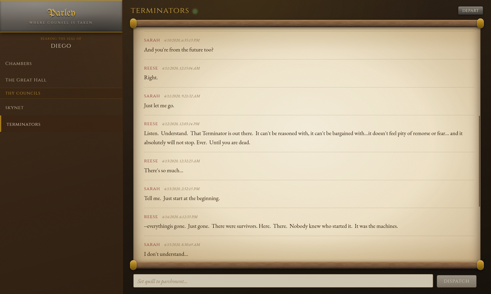
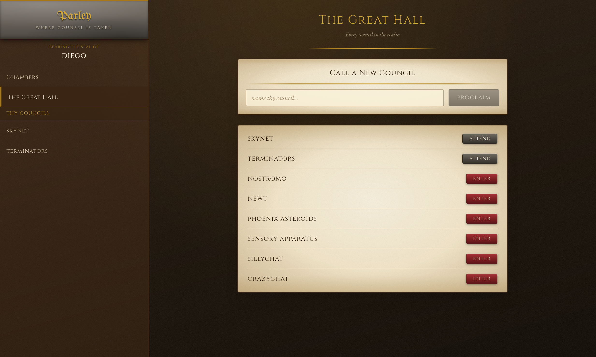
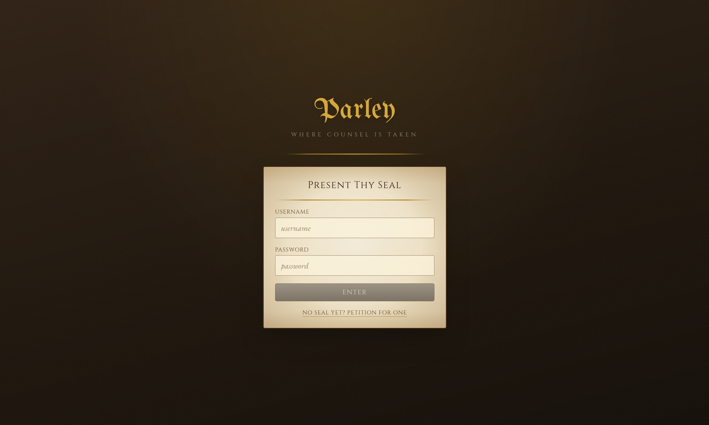

# Parley

**Where counsel is taken** — a real-time group chat application dressed as a medieval scriptorium.

Parley is a Discord-style messaging app: anyone can call a new *council* (a group chat), browse
every council in the realm, join the ones they like, and talk in them. Messages arrive live over a
WebSocket, and the whole thing is presented as ink on parchment.



---

## What it does

- **Councils (group chats)** — create one, browse all of them, join and leave freely. Membership is
  self-service; there are no invites to wait on.
- **Live messages** — new, edited and deleted messages are pushed over a WebSocket and written
  straight into the client cache. No polling.
- **Message authorship** — you may amend or strike your own messages. A council's owner may strike
  any message in their council, but never rewrite one.
- **Accounts** — register, log in, change your name, email or password, or burn your seal entirely.
- **Presence of the scroll** — a small light beside the council name shows whether the socket is
  connected.

### A note on the vocabulary

The interface is written in period voice. The mapping is:

| In the app | Means |
|---|---|
| Council | Group chat |
| The Great Hall | Browse every chat, and create one |
| Chambers | Account settings |
| Thy Councils | The chats you have joined |
| Dispatch | Send |
| Amend / Strike | Edit / Delete |
| Enter / Depart | Join / Leave |

---

## Screenshots

| The Great Hall | Signing in |
|---|---|
|  |  |

---

## Tech stack

**Backend** — Python 3.13

| | |
|---|---|
| [FastAPI](https://fastapi.tiangolo.com/) | HTTP and WebSocket routing, OpenAPI docs |
| [SQLModel](https://sqlmodel.tiangolo.com/) / [SQLAlchemy](https://www.sqlalchemy.org/) | ORM and schema, over SQLite |
| [python-jose](https://github.com/mpdavis/python-jose) | JWT signing and verification (HS256) |
| [bcrypt](https://github.com/pyca/bcrypt) | Password hashing |
| [Pydantic](https://docs.pydantic.dev/) + pydantic-settings | Request/response models and configuration |
| [uvicorn](https://www.uvicorn.org/) | ASGI server |
| [pytest](https://docs.pytest.org/) | Test suite |
| [uv](https://docs.astral.sh/uv/) | Dependency and environment management |

**Frontend** — Node 20+

| | |
|---|---|
| [React 19](https://react.dev/) + [TypeScript](https://www.typescriptlang.org/) | UI, in strict mode |
| [Vite 6](https://vite.dev/) | Dev server and build |
| [TanStack Query 5](https://tanstack.com/query) | Server state, caching and invalidation |
| [React Router 8](https://reactrouter.com/) | Routing |
| [Tailwind CSS 4](https://tailwindcss.com/) | Styling, via the Vite plugin |
| ESLint + typescript-eslint | Linting |

---

## Architecture

The backend is layered, and each layer only talks to the one below it:

```
backend/routers/              HTTP and WebSocket endpoints, OpenAPI annotations
backend/database/             business rules and queries; raises domain exceptions
backend/database/schema.py    SQLModel tables: accounts, chats, messages, chat_memberships
```

Domain errors (`backend/exceptions.py`) each carry their own status code and render to a consistent
`{"error": ..., "message": ...}` body, registered as handlers in `backend/main.py`. Every list
endpoint returns a `{"metadata": {"count": n}, "<items>": [...]}` envelope.

**Real-time delivery.** `backend/realtime.py` holds a connection manager keyed by chat id.
`WS /chats/{chat_id}/ws` authenticates the connecting user and streams `message_new`,
`message_edit`, `message_delete`, `member_join` and `member_leave` events to the members of that
chat. Payloads reuse the same Pydantic models the REST endpoints return, so the client writes them
directly into its TanStack Query cache. On the frontend this lives in `src/useChatSocket.ts`, which
reconnects with backoff and resyncs on reconnect.

Connections are held per process, so running more than one worker would need a shared broker
(Redis pub/sub or similar) behind the same interface.

**Authentication.** Registration and login issue a JWT signed with HS256. The API accepts the token
as either an `Authorization: Bearer` header or a cookie; the web client uses the bearer form.
Passwords are bcrypt hashed, and login performs the same work whether or not the account exists so
that response time does not reveal which usernames are taken.

---

## Running it

### Backend

Requires [uv](https://docs.astral.sh/uv/getting-started/).

```bash
uv sync
uv run fastapi dev backend
```

The API listens on `http://127.0.0.1:8000`. Interactive docs are at `/docs` (Swagger) and `/redoc`.

### Frontend

```bash
cd frontend
npm install
npm run dev
```

The app is served at `http://localhost:5173`, which is the origin the backend's CORS policy allows.
Run both at once.

### Configuration

Everything has a working development default, so neither command above needs setup. Four
environment variables override them:

| Variable | Default | Purpose |
|---|---|---|
| `JWT_SECRET_KEY` | a development key | Token signing key. **Required** outside development. |
| `APP_ENV` | `development` | Anything else makes the app refuse to start on the default signing key. |
| `DB_URL` | `backend/database/development.db` | SQLAlchemy database URL. Resolved from the package, not the working directory. |
| `DB_ECHO` | off | Set to `1` to log every SQL statement. |

---

## Testing

```bash
uv run pytest                 # 98 backend tests
cd frontend && npm run typecheck   # tsc --noEmit
cd frontend && npm run lint
cd frontend && npm run build       # typechecks, then bundles
```

Backend tests live in `backend/__tests__/`, using an in-memory SQLite database with fixtures in
`conftest.py`. They cover the REST endpoints, authorization rules, token validation, and the
WebSocket event stream (including auth refusals and cross-chat isolation). bcrypt is stubbed out in
tests to keep them fast.

There is no frontend test suite; the frontend is checked by the type checker, the linter and the
build.

---

## Layout

```
backend/
  main.py           app, CORS, exception handlers
  settings.py       configuration and env overrides
  realtime.py       WebSocket connection manager and events
  models.py         Pydantic wire models
  routers/          accounts, auth, chats
  database/         accounts, auth, chats, password, schema
  __tests__/        pytest suite
frontend/src/
  api.ts            fetch wrapper and typed error handling
  queries.ts        TanStack Query read hooks
  useChatSocket.ts  WebSocket client
  types.ts          wire types mirroring backend/models.py
  Chat.tsx          the scroll, messages and compose box
  accounts/         login, register, settings
  chats/            browse and create
  components/       shared form pieces
Screenshots/        images used above
```
